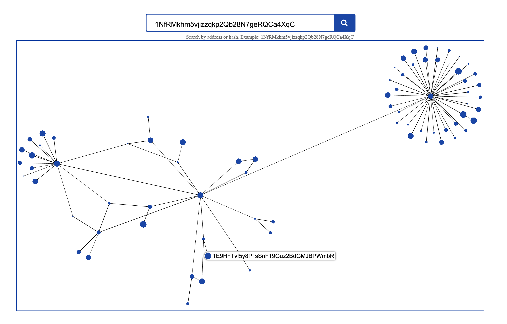

# bitcoin-graph-viz
A simple graph visualization of Bitcoin transactions using Sigma.js. The data is queried from blockchain.info.

Backend: A Node app that handles the queries and data conversions
Frontend: A web app using sigma.js for the graph rendering

## Tech stack:
* Webpack
* Babel
* ES6
* Sigma.js
* Node

## Screenshot:

